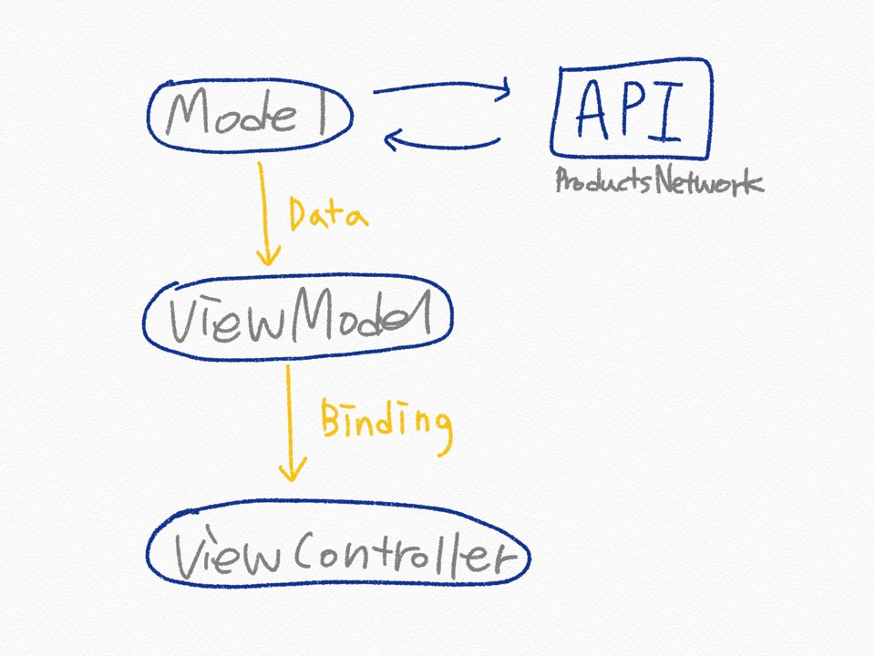

# Market

상품 정보를 보여주는 Market App

1. 상품 목록 화면


<br>

2. 상품 상세 화면


<br>

###  Feature
1. 상품 목록 정보
2. 상품 목록 Pull-to-Refresh
3. 상품 상세 화면
4. 상품 상세 전환 Animation
5. 상품 상세 이미지 Slider

<br>

### 설계



<br>

### 구현

| **구분** |   **역할**   |
| :------------- | :--------------- |
| **Views** |
|       ViewController       |       UIViewController에 bind하기 위한 공통 ViewController        |
|       ProductListViewController       |       viewModel에서 상품 목록 리스트를 받아 collection으로 뿌려준다.        |
|       ProductListViewModel       |       view로 binding 하는 역할        |
|       ProductListModel       |       상품 목록 리스트의 비즈니스 로직을 처리하는 부분.        |
|       ProductDetailViewController       |      viewModel에서 상품 상세 정보를 받아 뿌려준다.        |
|       ProductDetailViewModel       |               |
|       ProductDetailModel       |       상품 상세 정보의 비즈니스 로직을 처리하는 부분.         |
| **Components** |
|       ProductListCell       |       상품 목록 collection의 cell        |
| **Models** |
|       ProductResponse       |       idus API response 공통 모델        |
|       Product       |       idus API product 모델       |
| **Constans** |
|       Constants       |       App의 각종 상수        |
| **Network** |
|       ProductsNetwork       |       API Network protocol        |
|       ProductsNetworkImpl       |      API Network protocol 구현, API 함수와 URL생성       |
| **Extension** |
|       Observable+Distinct       |       직전 이벤트와 값이 다를 때(이전의 이벤트들은 상관없이) 방출하는 filter 메서드 extesion       |
|       Reactive+UIViewController       |       Toast 라이브러리를 Rx에서 사용하기 위한 extension        |

<br>

### Git Management

- master : 개발 및 최종본

**Commit Message 양식은 아래의 규칙을 따른다.**  

```
1. 기능 구현 : 구현 기능 - 내용 
2. 버그 수정 : 수정 기능 변경 전 -> 변경 후
```


### Style Guide

- Swift Dev Version : 5
- Deployment Target : 13.0
- Device Target : iPhone
- Code Architecture : MVVM
